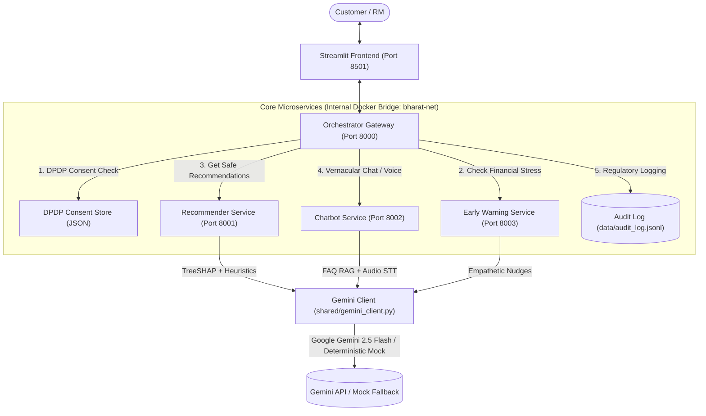

# Bharat AI Banking: AI-Powered Hyper-Personalized Banking for Bharat

[](https://opensource.org/licenses/MIT)
[](https://www.python.org/downloads/release/python-3110/)
[](https://www.docker.com/)
[](https://fastapi.tiangolo.com/)
[](https://streamlit.io/)
[](https://ai.google.dev/)
[](docs/ethical_safeguards.md)

> **Theme**: Digital Transformation in Lending  
> An intelligent, life-stage aware, vernacular financial co-pilot driving digital transformation in lending, proactive financial well-being, and ethical credit delivery for next-billion users across Bharat.

---

## 📌 Problem Statement & Bharat Persona

Over 400 million citizens in Tier 2, Tier 3, and rural India ("Bharat") remain underserved by traditional banking:
- **One-size-fits-all products**: Generic personal loans and credit cards are pushed without understanding the borrower's life stage, seasonal cash flows, or repayment capacity.
- **Predatory lending patterns**: Financially strained users are bombarded with high-interest credit lines rather than restructuring or counseling.
- **Linguistic barriers**: Traditional banking apps and relationship managers speak English or bureaucratic Hindi, alienating regional language speakers.
- **Privacy & Consent Deficit**: User financial data is scraped or shared without granular, revocable consent as mandated by the **Digital Personal Data Protection (DPDP) Act, 2023**.

**Bharat AI Banking** bridges this divide by delivering empathetic, vernacular, and life-stage aligned financial guidance while upholding strict regulatory and ethical safeguards.

---

## 🚀 Key Features

1. **Life-Stage Recommender Engine (Port 8001)**:
   - **XGBoost Classifier**: Classifies customers into life stages (`young_saver`, `first_borrower`, `growing_family`, `near_retirement`, `gig_worker`).
   - **Hybrid Scoring**: Blends heuristic content rules (savings rate, surplus, EMI ratios) with collaborative item co-occurrence matrices.
   - **TreeSHAP Explainability**: Computes mathematical feature contributions and converts them into natural language rationales in 10 Indian languages.
   - **Anti-Predatory Stress Gating**: Automatically suppresses high-risk credit lines when financial stress is detected and recommends free financial counseling.

2. **Vernacular Voice & Text Chatbot (Port 8002)**:
   - **10 Regional Languages + Hinglish**: Hindi (`hi`), English (`en`), Tamil (`ta`), Telugu (`te`), Bengali (`bn`), Marathi (`mr`), Gujarati (`gu`), Kannada (`kn`), Malayalam (`ml`), and Punjabi (`pa`).
   - **Multimodal Voice Pipeline**: Audio transcription via Gemini Flash and vernacular text-to-speech via gTTS.
   - **Grounded FAQ RAG**: Answers queries grounded strictly in `knowledge_base/banking_faq.md` to prevent hallucinations.
   - **Guided Form Auto-Fill**: Intelligently extracts loan entities (income, loan amount, tenure, purpose) from natural multi-turn conversation.
   - **Privacy Guard**: Verifies customer identity (e.g., DOB/PAN confirmation) before disclosing account balance or sensitive profile details.

3. **Early Warning Financial Stress Detection (Port 8003)**:
   - **Rolling Baselines**: Tracks personal z-score deviations across monthly discretionary spends, utility payments, and ATM patterns.
   - **Isolation Forest + Random Forest**: Pinpoints spending anomalies and calculates a comprehensive risk score (0–100).
   - **Disentanglement Classifier**: Differentiates between **Stress** (overdue EMI, income drop, emergency expenses) and **Fraud** (velocity surges, foreign IPs, suspicious timings).
   - **Empathetic Intervention**: Generates non-punitive, supportive intervention messages offering loan restructuring and fee waivers.

4. **Unified Orchestrator Gateway (Port 8000)**:
   - **DPDP Act 2023 Consent Enforcement**: Verifies purpose-specific consent (`recommendation`, `stress_detection`, `chatbot`, `marketing`) before processing requests.
   - **Consent Revocation API**: Instant real-time revocation of processing permissions with audit recording.
   - **Stress Gate Routing**: Inspects early warning indicators to alter recommendation payloads dynamically.
   - **RBI Compliance Audit Trail**: Writes tamper-evident, append-only records to `data/audit_log.jsonl`.

5. **Dual-Persona Streamlit Frontend (Port 8501)**:
   - **Customer View**: Personalized product recommendations, SHAP charts, vernacular voice/text assistant, financial health tracker, and DPDP consent controls.
   - **Relationship Manager (RM) View**: Portfolio stress distribution, customer drill-down, early warning intervention manager, and live regulatory audit stream.

---

## 🏛️ System Architecture



For comprehensive architectural design, see [docs/architecture.md](docs/architecture.md).

---

## ⚡ Quick Start

### Prerequisites
- [Docker](https://www.docker.com/) & Docker Compose (v2.0+)
- Python 3.11+ (if running locally without Docker)

### 1. Clone and Configure
```bash
cd bharat-ai-banking
cp .env.example .env
```
*Note: The platform is 100% functional out-of-the-box in deterministic mock mode without any API keys. To enable live Gemini LLM generation, set `GEMINI_API_KEY` in `.env`.*

### 2. Start with Docker Compose
```bash
docker compose up --build -d
```

Check container status:
```bash
docker compose ps
```
All 5 containers (`bharat-orchestrator`, `bharat-recommender`, `bharat-chatbot`, `bharat-early-warning`, `bharat-frontend`) will be in the `Up` state.

---

## 🌐 Access Endpoints

| Component | Port | URL | Description |
| :--- | :--- | :--- | :--- |
| **Streamlit Frontend** | `8501` | [http://localhost:8501](http://localhost:8501) | Customer & RM Dual-Persona Dashboard |
| **Orchestrator API** | `8000` | [http://localhost:8000/docs](http://localhost:8000/docs) | Gateway & DPDP Consent OpenAPI Docs |
| **Recommender API** | `8001` | [http://localhost:8001/docs](http://localhost:8001/docs) | Life-Stage & SHAP Recommender API |
| **Chatbot API** | `8002` | [http://localhost:8002/docs](http://localhost:8002/docs) | Vernacular RAG & Voice Chatbot API |
| **Early Warning API** | `8003` | [http://localhost:8003/docs](http://localhost:8003/docs) | Stress & Anomaly Detection API |

---

## 🎬 Demo Walkthrough

Follow our timed 3-minute demonstration script for judging and presentation:
👉 [docs/demo_script.md](docs/demo_script.md)

Slide deck outline:
👉 [docs/slides_outline.md](docs/slides_outline.md)

---

## 📂 Project Structure

```text
bharat-ai-banking/
├── docker-compose.yml              # 5-service container configuration
├── .env.example                    # Environment variable template
├── shared/                         # Shared libraries across microservices
│   ├── __init__.py
│   ├── config.py                   # Centralized configuration loader
│   ├── constants.py                # Supported languages, life-stages, products
│   └── gemini_client.py            # Gemini 2.5 Flash client with deterministic mock
├── services/
│   ├── orchestrator/               # Single entry gateway (Port 8000)
│   │   ├── Dockerfile
│   │   ├── requirements.txt
│   │   ├── main.py                 # Action gateway, consent & stress gating
│   │   ├── consent.py              # DPDP Act 2023 purpose-based consent engine
│   │   ├── audit.py                # RBI-compliant append-only JSONL audit logger
│   │   └── pipeline.py             # Asynchronous inter-service HTTP client
│   ├── recommender/                # Recommendation microservice (Port 8001)
│   │   ├── Dockerfile
│   │   ├── requirements.txt
│   │   ├── main.py                 # Product recommendation & life-stage endpoints
│   │   ├── features.py             # Feature engineering from transaction history
│   │   ├── model.py                # XGBoost life-stage classifier & hybrid ranker
│   │   └── explain.py              # TreeSHAP computation & multilingual explanations
│   ├── chatbot/                    # Vernacular chatbot microservice (Port 8002)
│   │   ├── Dockerfile
│   │   ├── requirements.txt
│   │   ├── main.py                 # Multilingual chat & voice endpoints
│   │   ├── gemini_chat.py          # Grounded FAQ RAG using banking_faq.md
│   │   ├── audio_handler.py        # Voice-to-text (Gemini) & text-to-speech (gTTS)
│   │   ├── form_fill.py            # Loan application entity extraction
│   │   └── identity.py             # Pre-disclosure customer verification guard
│   └── early_warning/              # Early warning stress detector (Port 8003)
│       ├── Dockerfile
│       ├── requirements.txt
│       ├── main.py                 # Stress check, intervention & anomaly endpoints
│       ├── baseline.py             # Rolling spending baseline & z-score calculation
│       ├── anomaly.py              # Isolation Forest & Random Forest risk scoring
│       └── intervene.py            # Empathetic counseling & restructuring copy
├── frontend/                       # Streamlit web application (Port 8501)
│   ├── Dockerfile
│   ├── requirements.txt
│   └── app.py                      # Interactive dual-view UI (Customer + RM)
├── data/                           # Data storage & persistence
│   ├── customer_profiles.json      # 50 synthetic Indian banking customer personas
│   ├── synthetic_transactions.json # 90-day transaction sequences with stress profiles
│   ├── consent_records.json        # DPDP consent states per customer
│   └── audit_log.jsonl             # Immutable regulatory audit log
├── knowledge_base/
│   └── banking_faq.md              # Grounded banking policy knowledge base
└── docs/                           # Detailed project documentation
    ├── architecture.md             # Microservices topology & data flows
    ├── ai_approach.md              # Machine learning models, SHAP, and RAG design
    ├── ethical_safeguards.md       # DPDP compliance & anti-predatory guidelines
    ├── demo_script.md              # Timed 3:00 video presentation walkthrough
    └── slides_outline.md           # 10-slide hackathon pitch deck
```

---

## 🗺️ Session Roadmap

| Session | Component / Milestone | Deliverables |
| :---: | :--- | :--- |
| **0** | **Scaffolding & Data** | Folder layout, 50 synthetic Indian customer profiles, 90-day transaction generator, Docker Compose baseline. |
| **1** | **Recommender Service** | `services/recommender/`: 10-feature extraction, XGBoost classifier, hybrid scoring, TreeSHAP, Gemini explanations, stress gate. |
| **2** | **Early Warning Service**| `services/early_warning/`: Rolling baselines, Isolation Forest anomaly detection, Random Forest risk scoring, stress vs fraud classifier, empathetic copy. |
| **3** | **Vernacular Chatbot** | `services/chatbot/`: 10 regional languages, Gemini FAQ RAG (`banking_faq.md`), gTTS voice, form entity extraction, privacy guard. |
| **4** | **Orchestrator Gateway**| `services/orchestrator/`: DPDP purpose consent checks, stress-gate routing, consent revocation API, RBI JSONL audit trail. |
| **5** | **Streamlit Frontend**  | `frontend/app.py`: Dual-persona UI (Customer View + Relationship Manager View), interactive voice chat, SHAP charts, audit viewer. |
| **6** | **Polish & Submission** | Bug fixes (life stage metadata, counseling copy, audit path, static HTML title), comprehensive docs, demo script, full Docker validation. |

---

## 🛠️ Tech Stack

- **Backend Framework**: Python 3.11, FastAPI, Uvicorn, Pydantic v2, HTTPX
- **Machine Learning**: Scikit-Learn (Isolation Forest, Random Forest), XGBoost (Classifier), SHAP (TreeExplainer), NumPy, Pandas
- **Generative AI & Audio**: Google Gemini 2.5 Flash (`google-generativeai`), gTTS (Google Text-to-Speech)
- **Frontend**: Streamlit, Altair / Matplotlib
- **DevOps & Infrastructure**: Docker, Docker Compose, Linux Alpine/Slim

---

## ⚖️ Ethical Safeguards & Compliance

- **DPDP Act 2023 Enforced**: Granular consent captured per processing purpose (`recommendation`, `stress_detection`, `chatbot`, `marketing`). Every event verifies valid consent before execution.
- **Anti-Predatory Stress Gate**: When a customer exhibits high financial distress, credit card and loan recommendations are **strictly blocked**. The customer is offered a complimentary financial counseling session instead.
- **Explainability as a Right**: Every AI recommendation includes human-understandable drivers generated from SHAP mathematical values.
- **Auditability**: All consent changes, recommendation events, and stress alerts are logged in an immutable, append-only JSONL format for RBI inspection.

Read the complete compliance framework in [docs/ethical_safeguards.md](docs/ethical_safeguards.md).

---

## ⚠️ Known Limitations & Future Work

- **Synthetic Data**: Models are trained and tested on high-fidelity synthetic data mimicking Indian banking patterns. Real-world deployment requires training on localized core-banking systems (CBS).
- **Gemini Mock Fallback**: While live Gemini 2.5 Flash integration is fully implemented, the fallback uses deterministic mock templates if an API key is not supplied.
- **Account Aggregator (AA) Integration**: Currently transactions are ingested via local JSON; production deployment will connect directly to Sahamati Account Aggregator APIs.

See [docs/ai_approach.md](docs/ai_approach.md) for deeper details on algorithmic design and future roadmap.

---

## 👥 Team & Acknowledgements

Developed for the **Digital Transformation in Lending** Hackathon.  
Built with pride for **Bharat** 🇮🇳.

---

## 📄 License

This project is licensed under the [MIT License](LICENSE).
