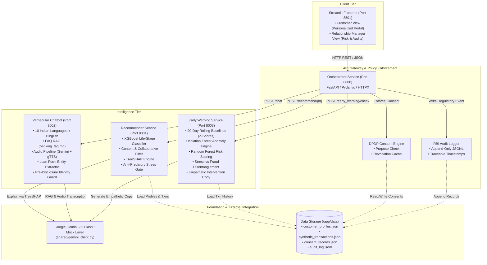
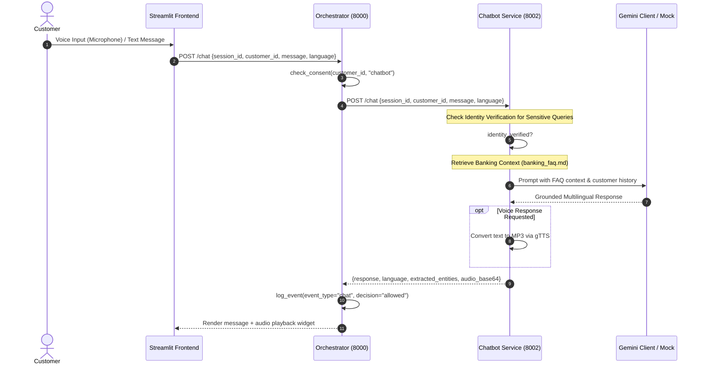

# Bharat AI Banking: System Architecture Specification

## 1. Architectural Overview

Bharat AI Banking is engineered as a decoupled, resilient, and privacy-first microservices system tailored to the operational realities of Indian digital lending. The architecture addresses high-concurrency event ingestion, regional language processing, machine-learning inference for credit evaluation, and strict compliance with the **Digital Personal Data Protection (DPDP) Act, 2023** and **Reserve Bank of India (RBI)** digital lending guidelines.

### 1.1 High-Level Architecture Diagram



---

## 2. Microservice Topology

All microservices communicate across an internal Docker bridge network (`bharat-net`). Outside access is restricted to the Frontend (`8501`) and Orchestrator API (`8000`), with individual service endpoints (`8001`, `8002`, `8003`) exposed for API documentation and automated testing.

| Service | Port | Base Path | Core Responsibilities |
| :--- | :---: | :--- | :--- |
| **Frontend** | `8501` | `/` | Responsive multi-persona UI; Customer self-service, vernacular voice chat, RM management dashboard. |
| **Orchestrator** | `8000` | `/` | API Gateway; DPDP consent validation, stress-gate routing, event choreography, immutable audit logging. |
| **Recommender** | `8001` | `/recommend` | Life-stage classification, personalized product matching, SHAP mathematical explanations, stress suppression. |
| **Chatbot** | `8002` | `/chat` | Vernacular conversational agent, FAQ retrieval-augmented generation, audio transcription & synthesis, form auto-fill. |
| **Early Warning** | `8003` | `/check`, `/intervene` | Behavioral anomaly detection, financial stress vs. fraud classification, proactive non-punitive intervention messaging. |

---

## 3. Component Interaction Flows

### 3.1 Customer Event Processing & Stress-Gated Recommendation

```mermaid
sequenceDiagram
    autonumber
    actor Customer
    participant Frontend as Streamlit Frontend
    participant Orch as Orchestrator (8000)
    participant EW as Early Warning (8003)
    participant Rec as Recommender (8001)
    participant Audit as Audit Logger (audit_log.jsonl)

    Customer->>Frontend: Trigger action (e.g. salary_credit / browse)
    Frontend->>Orch: POST /customer/{id}/action {event_type, language}
    
    Note over Orch: Step 1: Check DPDP Consent
    Orch->>Orch: check_consent(id, "recommendation")
    alt Consent Denied
        Orch->>Audit: log_event(event_type="consent_denied", decision="blocked")
        Orch-->>Frontend: HTTP 403 Forbidden {error: "consent_denied"}
    end

    Note over Orch: Step 2: Check Financial Stress
    Orch->>EW: POST /check/{id}
    EW-->>Orch: {stress_level: "high"|"low"|"none", risk_score: 82, ...}

    alt Stress Level == "high"
        Note over Orch: Step 3A: Trigger Empathetic Intervention & Safe Products
        Orch->>EW: POST /intervene/{id} {language}
        EW-->>Orch: {intervention_message, suggested_actions}
        Orch->>Rec: POST /recommend/{id} {stress_level: "high", language}
        Note over Rec: Stress Gate: Block credit lines; prepend Counseling
        Rec-->>Orch: {recommendations: [counseling, recurring_deposit, ...]}
        Orch->>Audit: log_event(event_type="intervene", decision="escalated")
        Orch-->>Frontend: Return intervention payload + counseling card
    else Stress Level != "high"
        Note over Orch: Step 3B: Standard Personalized Recommendations
        Orch->>Rec: POST /recommend/{id} {stress_level: "none", language}
        Rec-->>Orch: {life_stage, confidence, recommendations, ...}
        Orch->>Audit: log_event(event_type="recommend", decision="allowed")
        Orch-->>Frontend: Return personalized product recommendations
    end
```

### 3.2 Vernacular Voice & RAG Chat Flow



---

## 4. Data Pipeline & Storage

The system maintains a zero-external-database design using persistent, atomic, file-backed storage, perfectly portable across any on-premise or cloud container environment:

1. **`customer_profiles.json`**: 50 rich synthetic personas encompassing age, geography (metro, Tier 2, Tier 3, rural), occupation (salaried, gig worker, farmer, small trader), monthly income, credit score, and existing banking products.
2. **`synthetic_transactions.json`**: 90-day transaction sequences for all personas, containing timestamps, merchant codes, categories (`salary`, `groceries`, `emi`, `atm`, `utility`, `medical`), amounts, and flags simulating financial strain (salary delays, ATM spikes, missed EMIs).
3. **`consent_records.json`**: Explicit consent states mapping each `customer_id` to individual processing purposes (`recommendation`, `stress_detection`, `chatbot`, `marketing`), including opt-in dates and revocation status.
4. **`audit_log.jsonl`**: Regulatory append-only audit trail logging every automated decision, consent evaluation, and intervention for full RBI and DPDP inspectability.

---

## 5. Security, Networking & Consent Enforcement

- **Network Isolation**: All inter-service communication runs within the private Docker bridge `bharat-net`. No service database or backend is exposed to public routing.
- **DPDP Act 2023 Compliance Engine**:
  - **Purpose Limitation**: Consent is never bundled. A user can consent to `recommendation` while denying `stress_detection` or `marketing`.
  - **Fail-Closed Design**: If consent is missing, revoked, or invalid, downstream processing terminates immediately with HTTP `403 Forbidden`.
  - **Instant Revocation**: Real-time revocation via `POST /consent/revoke` instantly invalidates the orchestrator cache.
- **Pre-Disclosure Identity Guard**: The Chatbot service enforces multi-factor confirmation (DOB, PAN) before revealing account balances or credit records.

---

## 6. Resilience, Retries & Fallback Modes

- **HTTP Retry Engine**: Orchestrator uses an asynchronous retry loop with exponential backoff (`HTTPX` with status retry on `502`, `503`, `504`).
- **Deterministic Mock LLM Fallback**: If `GEMINI_API_KEY` is not provided or upstream API rate limits are encountered, all services seamlessly degrade to deterministic, rule-based template generation without throwing unhandled exceptions.
- **XGBoost Fallback**: If trained model files are unavailable, the Recommender service reverts to verified heuristic life-stage rules.
